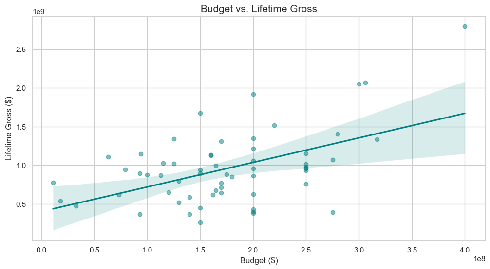
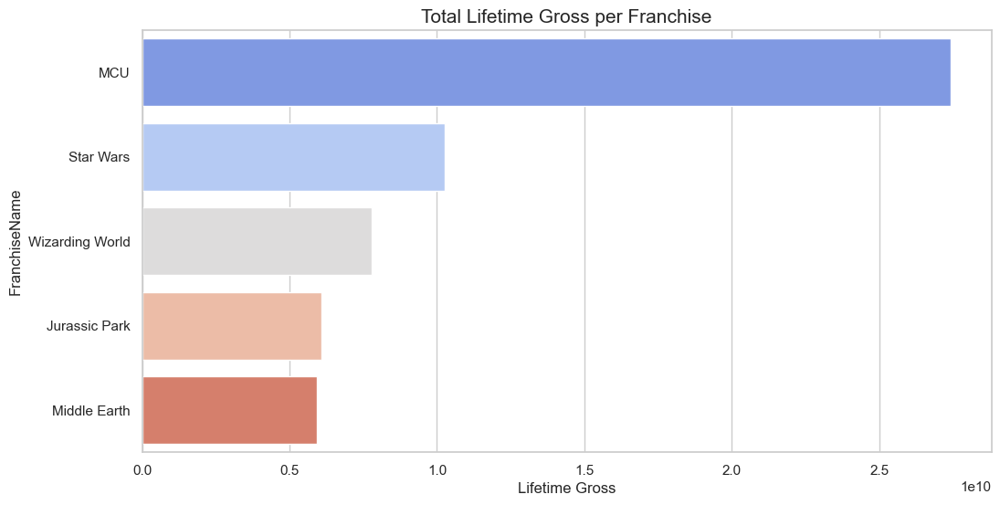
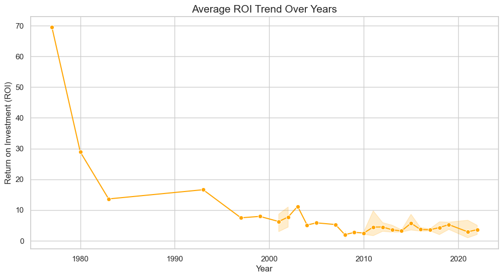
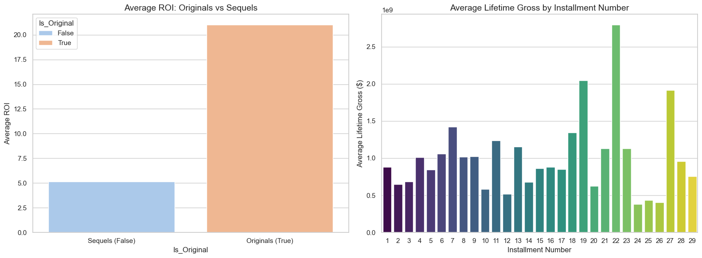

# 🎬 Cinematic Franchise Analysis: Successes vs. Failures

This repository contains a comprehensive data analysis project focused on **Sequel and Franchise Marketing in Cinema**. The study explores the dynamics of movie franchises, comparing originals vs. sequels, and identifying key drivers of financial and critical success in modern cinematography.

## 📌 Project Overview

Franchises have dominated the global box office for decades. This project utilizes a multi-section dataset to dissect performance across various dimensions:

- **Budgetary Impact**: Does higher investment always yield higher returns?
- **Sequel Dynamics**: How do sequels perform compared to their original counterparts as the installment number increases?
- **Moat Traits**: Identifying genres, studios, and ratings that contribute to a franchise "moat."
- **Predictive Success**: Analyzing ROI (Return on Investment) to classify movie success.

## 📊 Key Findings & Visualizations

### 1. Budget vs. Lifetime Gross

There is a strong correlation between production budget and lifetime gross, though many high-budget sequels face diminishing marginal returns.


### 2. Market Performance by Franchise

Top-tier franchises like _Star Wars_ and _The Avengers_ show massive lifetime earnings, setting benchmarks for the industry.


### 3. ROI Trends Over Time

Analyzing the history of cinema shows shifting trends in profitability. While gross earnings increase, rising production and marketing costs have pressurized the ROI of modern installments.


### 4. Genre Moats

Certain genres like **Action** and **Adventure** consistently provide higher lifetime gross, forming the backbone of most successful franchises.


## 🛠️ Technical Stack

- **Language**: Python 3.x
- **Data Manipulation**: `pandas`, `numpy`
- **Visualization**: `matplotlib`, `seaborn`
- **Notebook Environment**: Jupyter / `.ipynb`

## 📁 Dataset Structure

The analysis is based on `MovieFranchises.csv`, which is structured into several relational segments:

1. **Movies**: Financials, ratings, runtimes, and release dates.
2. **Cast & Directors**: Talent involved in each production.
3. **Genres**: Categorical metadata for genre classification.
4. **Franchises**: Higher-level mapping of movies to their respective cinematic universes.

## 🚀 How to Run

1. Clone this repository:
   ```bash
   git clone https://github.com/GyaneshSamanta/Sequel-Marketing-in-Cinema-Analysis.git
   ```
2. Install dependencies:
   ```bash
   pip install pandas matplotlib seaborn
   ```
3. Open and run the analysis notebook:
   ```bash
   jupyter notebook Cinematic_Franchise_Analysis.ipynb
   ```

## 📈 Future Work

- **Sentiment Analysis**: Incorporating social media sentiment to correlate marketing hype with opening weekend success.
- **Predictive Modeling**: Building a Random Forest or XGBoost model to predict a movie's "Success" label based on pre-release features.
- **Actor Moats**: Determining the "Star Power" index and its effect on franchise longevity.

---

_Developed as part of a comprehensive study into Cinema Marketing and Data Science._
